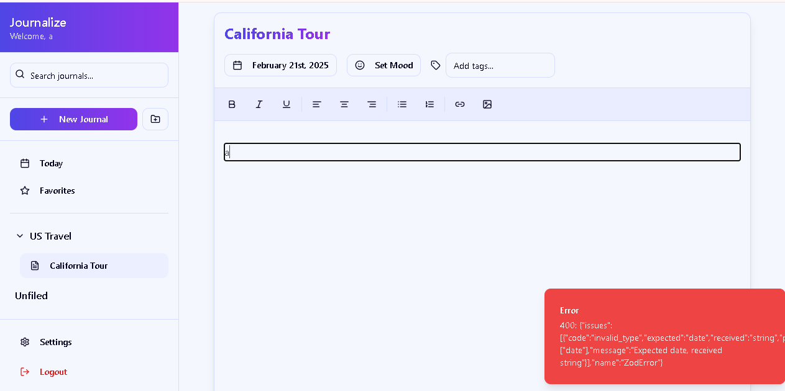

# Journalize - Digital Journal Web Application

Journalize is a comprehensive digital journaling web application built with the MERN stack, offering a rich text editing experience, intelligent file organization, and seamless user authentication.



## Features

### Authentication & Security
- Secure user authentication with username/password
- Password requirements validation
- Protected routes
- Session management
- Option for two-factor authentication

### Journal Management
- Create multiple journal types:
  - Daily Journal
  - Casual Journal
  - Gratitude Journal
  - Travel Journal
  - Dream Journal
- Rich text editing capabilities:
  - Multiple heading levels (H1-H6)
  - Text formatting (Bold, Italic, Underline)
  - Text alignment options
  - Ordered and unordered lists
  - Link insertion
  - Image upload support
  - Document attachments (.doc, .docx, .pdf)
- Real-time auto-save
- Tag system for organization
- Mood tracking
- Date management for entries

### Organization
- Folder system for journal organization
- Nested folder support
- Quick access to today's journals
- Favorite/star important entries
- Advanced search functionality:
  - Search by title
  - Search within content
  - Search by tags

### User Interface
- Clean, modern design
- Responsive layout (mobile, tablet, desktop)
- Dark/Light theme toggle
- Customizable interface
- Sidebar navigation
- Quick access toolbar

### Settings & Customization
- Profile management
- Password change functionality
- Theme preferences
- Notification settings
- Auto-save configuration
- Journal import/export capabilities
- Privacy and security settings

## Technologies Used

### Frontend
- React
- TypeScript
- TanStack Query (React Query)
- Tailwind CSS
- shadcn/ui components
- TipTap rich text editor
- Lucide React icons
- React Hook Form
- Zod validation
- Wouter for routing

### Backend
- Node.js
- Express.js
- MemoryStore for session storage
- Passport.js for authentication
- Zod for schema validation
- TypeScript

### Development Tools
- Vite
- TypeScript
- ESLint
- Prettier
- PostCSS

## Setup and Installation

1. Clone the repository
2. Install dependencies:
```bash
npm install
```

3. Start the development server:
```bash
npm run dev
```

The application will be available at `http://localhost:5000`

## Project Structure

```
├── client/
│   ├── src/
│   │   ├── components/
│   │   │   ├── editor/         # Rich text editor components
│   │   │   ├── layout/         # Layout components
│   │   │   └── ui/            # UI components
│   │   ├── hooks/             # Custom React hooks
│   │   ├── lib/               # Utility functions
│   │   ├── pages/             # Page components
│   │   └── App.tsx           # Main application component
├── server/
│   ├── routes.ts             # API routes
│   ├── storage.ts            # Data storage implementation
│   ├── auth.ts              # Authentication logic
│   └── index.ts            # Server entry point
└── shared/
    └── schema.ts           # Shared TypeScript types and schemas
```

## Key Dependencies

### Frontend Dependencies
- @tiptap/react: Rich text editor
- @tanstack/react-query: Data fetching and caching
- @hookform/resolvers: Form validation
- date-fns: Date manipulation
- lucide-react: Icons
- tailwindcss: Styling
- wouter: Routing

### Backend Dependencies
- express: Web framework
- passport: Authentication
- memorystore: Session storage
- zod: Schema validation

## Usage Guide

### Getting Started
1. Register an account or login if you already have one
2. Create your first journal by clicking the "New Journal" button
3. Choose a journal type and optionally assign it to a folder
4. Start writing using the rich text editor

### Organizing Journals
- Create folders using the folder icon in the sidebar
- Drag journals into folders
- Star important journals for quick access
- Use tags to categorize journals
- Search for journals using the search bar

### Customization
- Toggle dark/light mode in the settings
- Configure auto-save preferences
- Set up notifications
- Customize security settings

### Import/Export
- Export your journals as JSON files
- Import journals from JSON files
- Attach documents and images to your entries

## Contributing

Contributions are welcome! Please read the contributing guidelines before making any changes.

## License

This project is licensed under the MIT License - see the LICENSE file for details.
